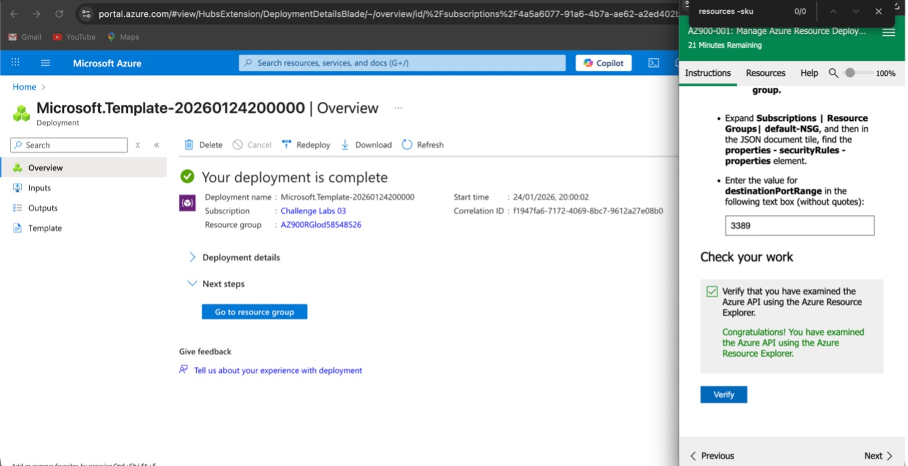
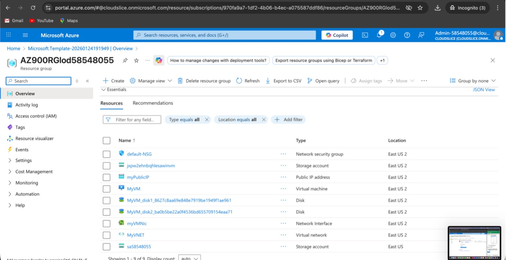
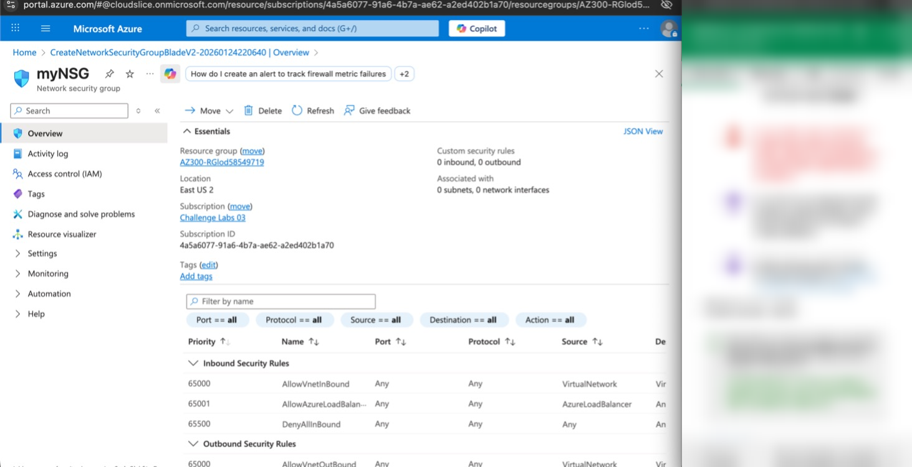
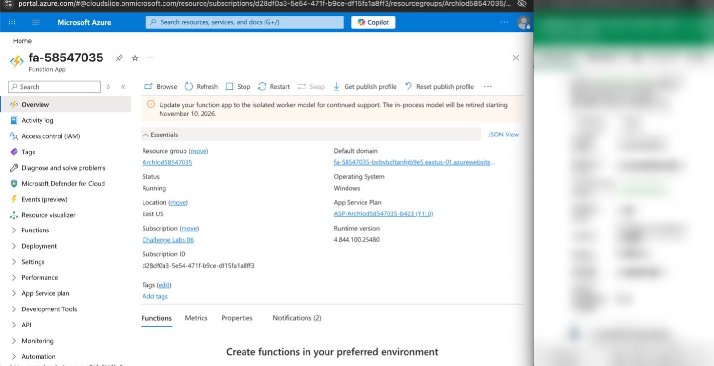
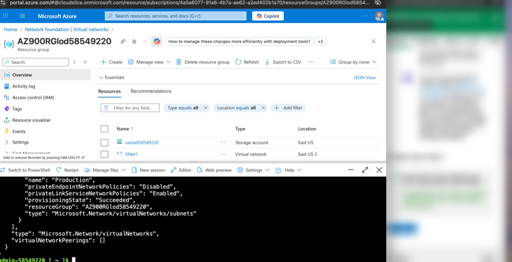

# Azure Cloud Infrastructure & Automation

### Azure Portal, Cloud Shell, ARM Deployment, NSG, and Function App Evidence

**Md Rahat Islam Anik · Azure Administrator · Cloud & Infrastructure Operations · 2026**

---

## Scope

This repository documents a guided Azure lab environment converted into a professional cloud operations case study. The screenshots show hands-on work in a temporary Azure lab tenant using the Azure Portal and Azure Cloud Shell.

The project is useful evidence for Azure fundamentals, resource deployment, networking basics, ARM deployment review, and cloud operations documentation. It is not presented as a production customer deployment.

---

## The Problem

An Azure environment deployed without structure can become difficult to govern — manual provisioning, unclear resource ownership, weak network boundaries, poor visibility into operational state, and inconsistent cost control.

## The Solution

A production-style Azure operations workflow documented from lab evidence: ARM deployment review, resource group inspection, Network Security Group validation, Azure Function App review, and Azure Cloud Shell command output. The README also identifies related governance topics that would need additional proof in a production-ready portfolio repo.

---

## Overview

This project covers selected Azure infrastructure operations activities — resource deployment, network security group review, serverless resource review, and Cloud Shell inspection. It also discusses governance, monitoring, secrets management, and cost control as important production considerations, but those areas are not fully evidenced in the current screenshot set.

For a visual summary that separates evidenced lab work from future governance patterns, see the [Azure infrastructure architecture diagram](docs/azure-infrastructure-architecture.html).

---

## What Was Built

### Infrastructure & Automation

**Azure Resource Deployment — Portal and Cloud Shell**
Resources were reviewed using both the Azure Portal for visual configuration and Azure Cloud Shell (Bash) for command-line inspection. This demonstrates familiarity with the two common Azure administration surfaces.

**Infrastructure as Code — ARM Templates**
ARM deployment evidence is shown through the Azure deployment details screen. Infrastructure as Code is discussed as the production pattern; the source ARM template is not included in this repository.

**Virtual Networking — Network Security Groups**
Network Security Group evidence is shown through the Azure portal. The screenshot demonstrates NSG resource creation/review and default rule visibility; custom rule hardening is not fully evidenced in this repository.

**Serverless — Azure Functions**
Azure Functions were reviewed as a serverless compute component, demonstrating exposure to lightweight cloud compute beyond virtual machines.

---

### Operations & Governance

**Role-Based Access Control (RBAC)**
RBAC is included as a production governance concept. The current evidence set does not include role assignment screenshots, so this repo should not be treated as proof of completed RBAC implementation.

**Azure Monitor — Resource Health & Metrics**
Azure Monitor is included as a recommended production operations layer. The current evidence set does not include Azure Monitor configuration screenshots.

**Cost Management — Spending Visibility & Governance**
Azure Cost Management is included as a recommended governance layer. The current evidence set does not include Cost Management dashboard screenshots.

---

### Security & Secrets Management

**Azure Key Vault — Secrets & Encryption**
Azure Key Vault is included as a recommended secrets-management pattern. The current evidence set does not include a Key Vault screenshot or source code showing Key Vault integration.

**Least-Privilege Access**
Least-privilege access is documented as the target security principle. Additional RBAC and Key Vault evidence would be needed to prove implementation in a production-style portfolio review.

---

## Evidence Status

| Area | Status | Evidence |
|---|---|---|
| ARM deployment | Evidenced | Deployment completion screenshot |
| Resource group review | Evidenced | Resource group overview screenshot |
| Network Security Group | Partially evidenced | NSG overview/default rules screenshot |
| Azure Function App | Evidenced | Function App overview screenshot |
| Azure Cloud Shell | Evidenced | Cloud Shell command output screenshot |
| ARM template source | Not included | Future improvement |
| RBAC assignments | Discussed, not evidenced | Future improvement |
| Azure Key Vault | Discussed, not evidenced | Future improvement |
| Azure Monitor | Discussed, not evidenced | Future improvement |
| Cost Management | Discussed, not evidenced | Future improvement |
| Production deployment | Not claimed | Temporary Azure lab environment |

---

## Tech Stack

| Category | Tools & Services |
|---|---|
| Cloud Platform | Microsoft Azure |
| Deployment | Azure Portal · Azure Cloud Shell (Bash) |
| Infrastructure as Code | ARM Templates |
| Networking | Virtual Networks · Network Security Groups (NSGs) |
| Compute | Azure Functions (Serverless) |
| Identity & Access | Role-Based Access Control (RBAC) |
| Security | Azure Key Vault · Least-Privilege Access |
| Monitoring | Azure Monitor |
| Cost Governance | Azure Cost Management |

---

## Skills Demonstrated

`Azure Resource Deployment` · `ARM Templates` · `Infrastructure as Code` · `Network Security Groups` · `RBAC` · `Azure Key Vault` · `Secrets Management` · `Azure Monitor` · `Azure Functions` · `Cost Management` · `Azure Cloud Shell` · `Least-Privilege Access` · `Cloud Governance`

---

## Screenshots

Configuration evidence from the temporary Azure lab environment.

For a screenshot-by-screenshot evidence summary, see [docs/evidence-map.md](docs/evidence-map.md).

### ARM Template Deployment

### Resource Group Overview

### Network Security Group Rules

### Azure Function Application

### Azure Cloud Shell (CLI)

---

## Author

**Md Rahat Islam Anik**
Azure Administrator · Cloud & Infrastructure Operations Specialist · Toronto, Canada

